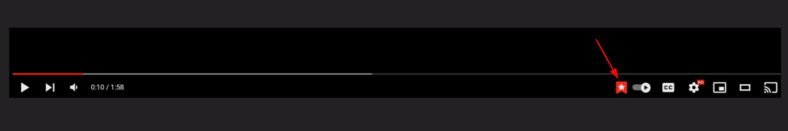
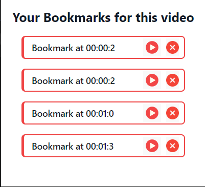
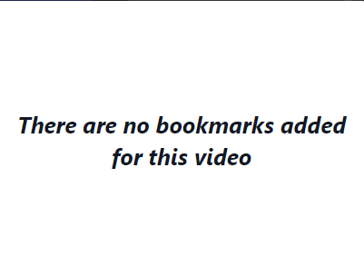
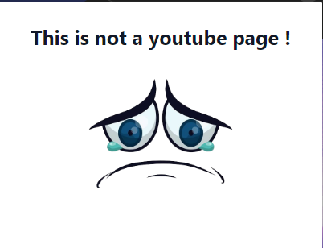

# BookyTube


# A chrome extension that allows you to bookmark timestamps from any Youtube video

## To run on your Chrome browser


Clone the project

```bash
  git clone https://github.com/eslamwaeldev/BookyTube
```
- Open Chrome broweser
- Go to extention Tab
- Enable Developer mode
- Drag the dist file from the cloned project and then drop in the extention tab 

## Preview

Bookmark any timestamp using a bookmark button added to the youtube control bar



Multiple bookmarks for a  video



A video with no bookmarks



If the page is not a youtube page




